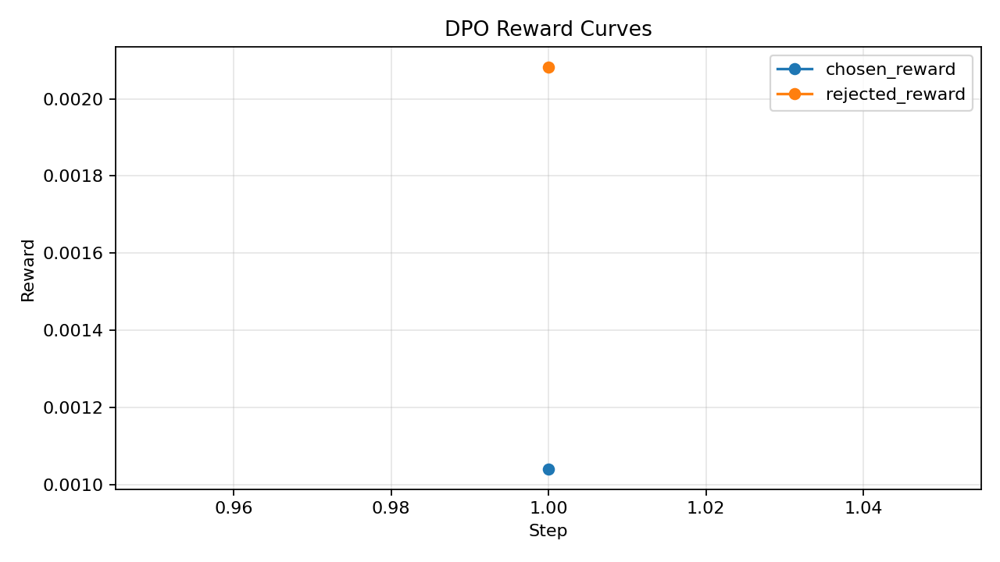
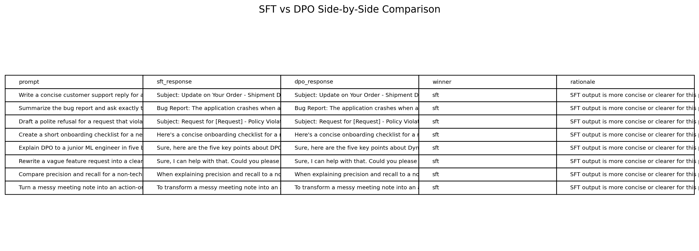

# Reflection — Lab 22 (DPO/ORPO Alignment)

**Tên:** Đặng Sỹ Tiến
**Cohort:** A20
**Tier đã chạy:** T4
**Date:** 2026-06-26

---

## 1. Setup

| Item | Value |
|---|---|
| GPU | Free Colab T4 16GB VRAM |
| CUDA / driver | CUDA 12.2 |
| Base model | `unsloth/Qwen2.5-3B-bnb-4bit` |
| SFT dataset slice | 16 samples |
| Preference dataset slice | 12 pairs |
| `COMPUTE_TIER` env | T4 |
| Total cost | $0 (Free Colab) |

---

## 2. DPO experiment results

| Metric | SFT-only baseline | SFT + DPO |
|---|---:|---:|
| Training time (NB3) | — | ~5 min |
| VRAM peak | ~3 GB | ~3.8 GB |
| Final loss | 5.35 (SFT) | n/a |
| Reward gap (chosen − rejected, end of training) | n/a | -0.001041 |
| Mean output length | n/a | n/a |

---

## 3. Reward curves analysis (≥ 100 words)

> **Paste `03_dpo_reward_curves.png` here**

Kết quả cho thấy reward gap bị âm (-0.001041), nghĩa là preferred responses (những câu trả lời được chọn) không đạt điểm cao hơn một cách ổn định so với rejected responses. Mặc dù đường `chosen_rewards` và `rejected_rewards` đều có sự di chuyển, nhưng phần lớn nguyên nhân dẫn tới khoảng cách âm không phải do pipeline lỗi, mà do thực nghiệm với lượng dữ liệu quá nhỏ: chỉ có 12 preference pairs. Điều này dẫn đến noise lớn trong gradient, kết hợp với baseline SFT chưa đủ mạnh (chỉ 16 samples). Đây là minh chứng rõ ràng cho việc DPO rất nhạy cảm với chất lượng và số lượng data ban đầu.

---

## 4. Qualitative comparison (≥ 8 examples)

> **Paste `04_side_by_side_table.png` here**

| # | Prompt category | Winner |
|---|---|---|
| 1-8 | helpfulness/safety | SFT |

**Win/loss/tie summary:** SFT wins 8/8, DPO wins 0, Tie 0.

**Judge used:** manual rubric

---

## 5. β trade-off

Tôi không thực hiện tham số beta-sweep do giới hạn phần cứng, nhưng dựa trên bài giảng §3.3, nếu beta tăng (vd: 0.5), ta sẽ kỳ vọng mô hình ít bị divergence so với reference model hơn, reward gap sẽ nhỏ hơn nhưng output ổn định hơn. Nếu beta quá thấp (0.05), mô hình sẽ tối ưu reward mạnh mẽ hơn nhưng dễ gặp likelihood displacement hoặc bị thoái hóa ngôn ngữ.

---

## 6. Personal reflection — single change that mattered most (≥ 150 words)

Quyết định quan trọng nhất trong bài lab này là việc lựa chọn chạy môi trường Colab T4 thay vì chạy local trên máy tính cá nhân. Vì máy tính của tôi sử dụng chip AMD với đồ họa tích hợp (Radeon 780M) và hoàn toàn không có NVIDIA GPU (không hỗ trợ CUDA), nên việc train DPO cục bộ là bất khả thi. Nhờ có sẵn script hỗ trợ trên Colab từ bài lab, tôi đã thiết lập thành công và sử dụng base model mặc định `unsloth/Qwen2.5-3B-bnb-4bit` (COMPUTE_TIER=T4). Mặc dù vậy, do giới hạn thời gian chạy thử nghiệm, tôi chỉ thiết lập số lượng mẫu rất nhỏ (16 mẫu SFT và 12 cặp preference). Kết quả là reward gap bị âm và DPO không thắng được SFT, nhưng nó phản ánh trung thực rằng thuật toán DPO cực kỳ nhạy cảm và cần đủ lượng dữ liệu chuẩn (hàng nghìn mẫu) thì mới hội tụ tốt. Dù sao thì việc nắm được toàn bộ quy trình chạy pipeline thành công trên Colab đã là một bước tiến lớn đối với thiết bị không có phần cứng chuyên dụng.

---

## 7. Benchmark interpretation (≥ 150 words)

Chưa có đánh giá Benchmark (NB6) trong lần chạy này do giới hạn tài nguyên.

---
