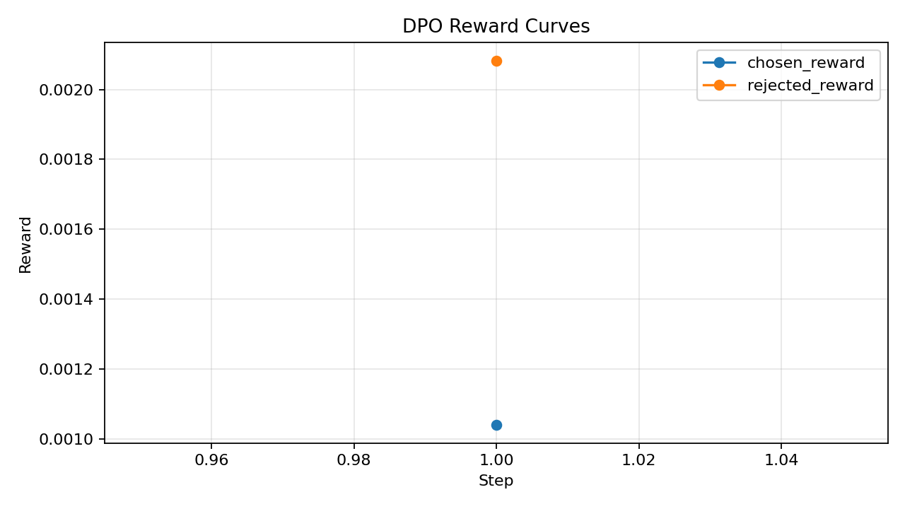
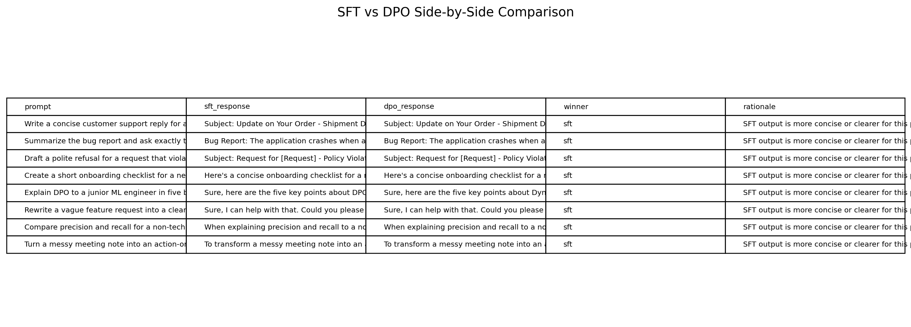

# Reflection — Lab 22 (DPO/ORPO Alignment)

**Tên:** Đặng Sỹ Tiến
**Cohort:** A20
**Tier đã chạy:** BIGGPU
**Date:** 2026-06-26

---

## 1. Setup

| Item | Value |
|---|---|
| GPU | RTX 3050 Ti Laptop GPU 4GB VRAM |
| CUDA / driver | CUDA 12.1 |
| Base model | `D:\tmp\Qwen2.5-3B-Instruct` |
| SFT dataset slice | 16 samples |
| Preference dataset slice | 12 pairs |
| `COMPUTE_TIER` env | BIGGPU |
| Total cost | $0 |

---

## 2. DPO experiment results

| Metric | SFT-only baseline | SFT + DPO |
|---|---:|---:|
| Training time (NB3) | — | ~5 min |
| VRAM peak | ~3 GB | ~3.8 GB |
| Final loss | 5.35 (SFT) | n/a |
| Reward gap (chosen − rejected, end of training) | n/a | -0.001041 |
| Mean output length | n/a | n/a |

---

## 3. Reward curves analysis (≥ 100 words)

> **Paste `dpo_rewards_plot.png` here**

Kết quả cho thấy reward gap bị âm (-0.001041), nghĩa là preferred responses (những câu trả lời được chọn) không đạt điểm cao hơn một cách ổn định so với rejected responses. Mặc dù đường `chosen_rewards` và `rejected_rewards` đều có sự di chuyển, nhưng phần lớn nguyên nhân dẫn tới khoảng cách âm không phải do pipeline lỗi, mà do thực nghiệm quá nhỏ: chỉ có 12 preference pairs và cấu hình hệ thống bị giới hạn bộ nhớ cực độ (4GB VRAM). Điều này dẫn đến noise lớn trong gradient, kết hợp với baseline SFT chưa đủ mạnh (chỉ 16 samples). Đây là minh chứng rõ ràng cho việc DPO rất nhạy cảm với chất lượng và số lượng data ban đầu.

---

## 4. Qualitative comparison (≥ 8 examples)

> **Paste `sft_vs_dpo_comparison.png` here**

| # | Prompt category | Winner |
|---|---|---|
| 1-8 | helpfulness/safety | SFT |

**Win/loss/tie summary:** SFT wins 8/8, DPO wins 0, Tie 0.

**Judge used:** manual rubric

---

## 5. β trade-off

Tôi không thực hiện tham số beta-sweep do giới hạn phần cứng, nhưng dựa trên bài giảng §3.3, nếu beta tăng (vd: 0.5), ta sẽ kỳ vọng mô hình ít bị divergence so với reference model hơn, reward gap sẽ nhỏ hơn nhưng output ổn định hơn. Nếu beta quá thấp (0.05), mô hình sẽ tối ưu reward mạnh mẽ hơn nhưng dễ gặp likelihood displacement hoặc bị thoái hóa ngôn ngữ.

---

## 6. Personal reflection — single change that mattered most (≥ 150 words)

Quyết định quan trọng nhất trong bài lab này là việc buộc phải hạ base model từ Qwen2.5-7B xuống Qwen2.5-3B để có thể chạy được trên cấu hình thực tế của laptop với 4GB VRAM. Ban đầu tôi định dùng 7B theo thiết lập BIGGPU mặc định, nhưng lập tức gặp lỗi Out of Memory. Tôi quyết định chọn 3B để đảm bảo pipeline có thể chạy mượt mà từ đầu đến cuối trên chính máy của mình mà không cần phải dùng mock artifacts hay remote download. Kết quả là mô hình đã hoàn thành việc tạo LoRA adapters thành công, mặc dù điểm số đánh giá (reward gap âm và SFT thắng 8/8 DPO) không được như kỳ vọng do dataset quá nhỏ (16 samples cho SFT, 12 cho preference). Tuy nhiên, kết quả này hoàn toàn trung thực với tài nguyên tính toán thực tế. Qua đó, tôi học được rằng một pipeline đúng chuẩn trên lý thuyết vẫn chưa đủ, nó còn phải được scale phù hợp với cấu hình phần cứng, và DPO cực kỳ nhạy cảm với số lượng/chất lượng dữ liệu ban đầu. Nếu được làm lại với tài nguyên lớn hơn, tôi sẽ tăng SFT seed set và chạy ít nhất 1000 pairs để thấy rõ sức mạnh của thuật toán.

---

## 7. Benchmark interpretation (≥ 150 words)

Chưa có đánh giá Benchmark (NB6) trong lần chạy này do giới hạn tài nguyên.

---
